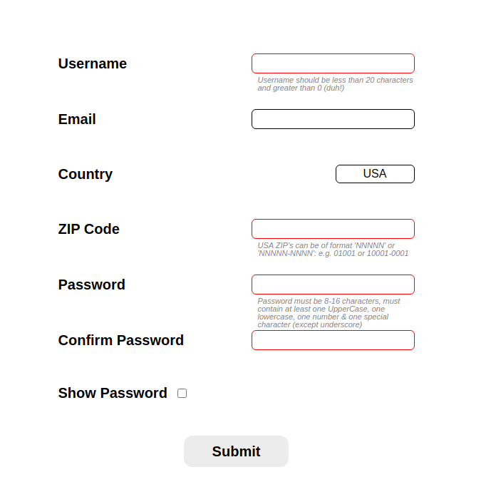

# Form Validation Example

## ABOUT 
This project is a part of lesson [Form Validation with JS](https://www.theodinproject.com/lessons/node-path-javascript-form-validation-with-javascript). We were asked to tinker with our [Library Project Form](https://github.com/Sahilcreate/library-project) and make new form with just JS validation.

[Click here](https://sahilcreate.github.io/Form-validation-example/) to view live.

## OBJECTIVES
- [x] It should use live inline validation to inform the user whether a field is properly filled in or not
- [x] The form doesn’t need to actually submit, but you should give an error message if the button is pushed with any active errors or unfilled required fields
- [x] make sure the <form> element has the novalidate attribute which will allow you to do all of your validation in your JavaScript files
